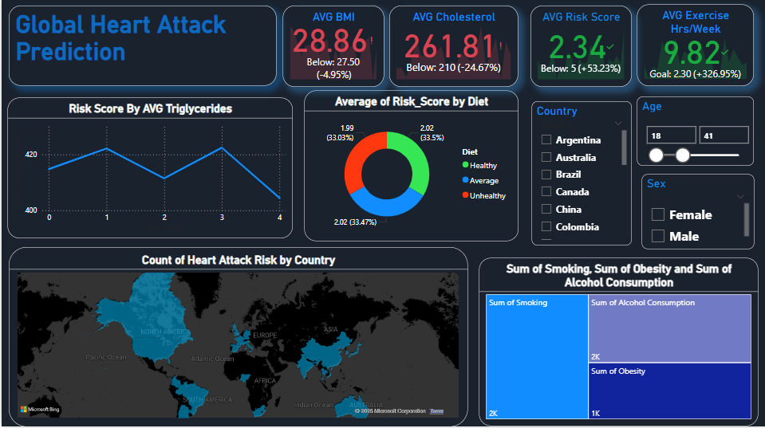

[](https://github.com/KabbisB/KabbisB.github.io/blob/main/_config.yml)
<h1 align="center">Hi 👋, I'm Benjamin Kabbis</h1> 


<h3 align="center">I am a Data Analyst with 2+ years of experience turning complex data into actionable insights. Skilled in Python, SQL, Excel, Power BI, and Tableau, I find passion in data visualization, predictive modeling,and process optimization. I have successfully executed data migration, improved decision-making velocity, and minimized operating costs. Data security and compliance are at the heart of what I do, along with business acumen and stakeholder management & Agile experience to deliver real solutions.</h3>


<p align="left">  </p>

<h3 align="left">Connect with me:</h3>
<p align="left">
<a href="https://linkedin.com/in/kabbis benjamin" target="blank"></a>
<a href="https://www.leetcode.com/kabbis" target="blank"></a>
</p>

<h3 align="left">Languages and Tools:</h3>
<p align="left"> <a href="https://www.w3schools.com/css/" target="_blank" rel="noreferrer">  </a> <a href="https://www.w3.org/html/" target="_blank" rel="noreferrer">  </a> <a href="https://www.microsoft.com/en-us/sql-server" target="_blank" rel="noreferrer">  </a> <a href="https://www.mysql.com/" target="_blank" rel="noreferrer">  </a> <a href="https://www.postgresql.org" target="_blank" rel="noreferrer">  </a> <a href="https://www.python.org" target="_blank" rel="noreferrer">  </a> </p>

<p></p>

<p>&nbsp;</p>

<p></p>


### **Project 1: [Heart Attack Prediction](https://github.com/KabbisB/KabbisB.github.io/blob/main/HeartAttackPredictionReport.pbix)**


----

**1. Tools Used**


**(a) Power BI for Loading and Cleaning the Data**

- Power BI worked well for this, it can load in data from multiple formats like excel or csv.
- It makes sure that data can be processed smoothly.
  
**(b) Imputation of Missing Values**

- The missing data were treated by the following methods:
- Missing value rows were dropped or imputed
- Gaps for categorical columns, such as *Diet*, were replaced with the most common value.
- For the numeric columns like *Cholesterol* or *Heart Rate*, the average was put in place of the missing values.
  
**(c) Transformation of Data**
  
- Power Query was used to transform the data. Using the following DAX formula, a new measure for Risk Score was created:
  ```DAX
  Risk_Score = 
 (IF(VALUE([Cholesterol]) > 200, 1, 0)) +
(IF(VALUE([Obesity]) = 1, 1, 0)) +
(IF(VALUE([Smoking]) = 1, 1, 0)) +
( IF( VALUE([Exercise Hours Per Week]) <2, 1, 0 ))
  ```
- The above formula calculates a straightforward risk score across several health factors.
- Other measures that we calculated with DAX were:
  - Average BMI  
  - Average Cholesterol Levels
  - Average Risk Score  
  - Average Exercise Hours per Week
    
**(d) Data Formatting**

- Columns were properly labeled to fulfill analysis requirements:
  
  **Continuous variables (Numbers):**
  
- Age, Cholesterol, Blood pressure
  
   **Categorical Variables:**
  
- Sex, Smoking, Diabetes, Heart Attack Risk

**2. Project Description**

With a dataset with factors as such as age, medical history, and lifestyle choices, this project deals with making a heart attack risk prediction model. Designed a Power BI dashboard to help clinicians identify patients with high risk and the top contributors in causing the heart attacks.


**3. Key Findings**

**Identified Risk Factors**
— Smokers, people with high cholesterol and those under stress were at a higher risk of heart attacks.
— Lack of exercise and obesity accounted for a considerable portion of the increased risk.

**Model Impact**

— The heart risk scoring model helps healthcare workers to:
— Diagnose the high-risk people early.
— Intervene in a timely manner and implement preventative measures.

**Actions You Can Take Right Now**

  - **Prevention:** Promote behavior change like greater amounts of activity, cessation of smoking and reduced cholesterol levels
  - **Healthcare Policies:** Information from this model can help public health measures aimed at people at risk.

**4. Dashboard Overview**



**Power BI EDA (Exploratory Data Analysis)**

This dashboard includes visuals which give insights into the data:

**(a) Line Graph**  

- **Risk Score Triglycerides vs Average Triglycerides:**

- The higher the triglycerides, the greater the risk of heart attacks and other cardiovascular disease.
- Triglycerides, a variety of fat in the blood, were positively associated with heart attack risk.
- This association was stronger among males which may be due to differences in lifestyle.
  
**(b) Donut Chart**

- **Average Risk Score by Diet Type**:

- A healthy diet was linked to a less risky score than an unhealthy diet.
- Perhaps note the most impressive, this effect of which are both Argentina and Colombia diets on heart attack rate.
  
**(c) Treemap**

- **Smoking, Obesity and Alcohol Consumption Combined:**

- This visualization highlighted how unhealthy lifestyles lead to heart attacks.
– Risk was sharply elevated in those who smoked, were obese, or consumed alcohol.

**(d) Map Visualization**

- **Topography of High-Risk Patients:**
  
- This map represents the number of high-risk patients across each country, with varying shades of color corresponding to the average risk of heart attack.
  
**(e) Slicers for Filter**

- **Sex**, **country**, and **age group** slices were added to filter and drill down into demographics.

**(f) Upper Part (KPIs)**

**KPI Cards:**  

- Average BMI: **27.5**  
- HDL Cholesterol Risk Score: **<5**
- Cholesterol: **210 mg/dL**
- Average Weekly Training Spend: **2.3 hours**
  


### **Project 2:Movies Dataset Analysis Project — IMDB**

---

**Objective**

The goal of this project is to perform exploratory and descriptive analysis on the top 1000 movies: the IMDB movie dataset. It contains extensive details about the movies such as ratings, directors, actors, genre, runtime, revenue, etc. In this analysis, we explore the movie data set and answer some SQL based questions on it to gain insights on trend in movie industry and performances of actors and directors.


**Dataset Overview**

**1. Context**

IMDB Top 1000 Movies and TV Lists The data set contains 1000 movies and TV lists. It could be helpful in understanding the factors that lead to the success of a movie and show including gross revenue versus votes, ratings versus directors and actors, etc.

**2. Content**

Here are the columns of the dataset:

| Column Name        | Description                                                                 |
|--------------------|-----------------------------------------------------------------------------|
| **Title** | **Series_Title**   Title of movie or TV show.` |
| **Released_Year** | Year in which the movie/TV show was released. |
| **Certificate**    | The age certificate (i.e. PG, R, etc.) |
| **Runtime**        | Total runtime (in minutes). |
| **Genre**          | Genre(s) (e.g., Drama, Comedy, etc.) of the movie. |
| **IMDB_Rating**    | IMDB rating of the movie/show (on a scale of 1-10) |
| **Overview**          | Sentence or two about the movie/TV show. |
| **Meta_score**     | The critic score for the movie/TV show (which MetaCritic aggregates). |
| **Director**       | Names of the movie/TV show director. |
Star1 | Star2 | Star3 | Star4 | Names of the main actors starring in the move. |
| **No_of_votes** | Total no. of votes received by the movie/show from IMDB. |
| **Gross**          | Total revenue received by the film (USD). |


**Discussion Points & Takeaways**

1. **Analyzer for Gross Revenue vs. Directors:**
- Find the directors who make the most grossing movies.
- Look into if any directors tend to make successful movies.
2. **Gross Revenue vs. Actors:**
- Find out what actors are involved with top grossing films.
- Work together to see how the actors add up to box office.
3. **Balloting Place vs. Directors:**
- Analyze which directors draw the most (through votes) audience interaction.
- Gain insights into director's popularity vs movie ratings
4. **No. of Votes vs. Actors:**
- Find out who are the most-enacted actors, on average.
– Examine whether some combinations of actors produce greater amounts of audience engagement.
5. **Actor-Genre Preferences:**
It might not be a gift (or is it?) — at least not if there are specific genres that are preferred by certain actors.
- What genres are top stars gravitating toward?
6. **Pairing of Actors and IMDB Ratings:**
- Find the leading combinations of actors that drive high IMDB scores.
- Check if certain pairings are correlated with genres.
7. **Actor Pairings and Gross Revenue**
- Find pairs of actors with high revenue.
- Look for trends / correlations between actors working together and making money.


**Dataset Preparation**

**1. Data Cleaning**

– **Completed missing values:**

- And then apply any technique to fill in any missing values for the columns `Meta_score`, `Gross`, etc.

- **Standardizing Formats:**
- 
- Cast `Released_Year` as a numeric.
- `Gross` and `Runtime` formatting for numerical analysis
- 
- **Removing Duplicates:**
  
- Remove duplicated entries to have correct results.

**2. Derived Metrics**

— Measure advanced insights:
Gross / No. of Votes = Revenue per Vote

- **Directors Average Rating:** Average IMDB rating of all showed movies per director
- 
- **Actor Collaboration Frequency**: How many times actors have worked a project together


**Exploratory Data Analysis (EDA)**

**1. Gross Revenue Trends**

- Distribution of `Gross` by movie
- Get top 10 grosser movies

**2. IMDB Ratings**

- Get the distribution of `IMDB_Rating`, and the `Meta_score` correlation with it
- Discover the highest-rated movies and the ingredients behind their success.
  
**3. Director Analysis**

- Identify which directors directed the most movies
- Examine the correlation between directors and average film gross/income.
  
**4. Genre Analysis**

- Examine the genre popularity.
- Genre preferences by year and region
  
**5. Actor Insights**

- Find out which actors occur the most in the dataset
- Exploring the gross box office collection and IMDB rating of movies which have mentioned actors.
  

**SQL-Based Questions**

1. **Top 5 Grossing Movies:**


2. **Average Gross and Top Directors:**
   
```sql

```
3. **Most Voted Movies:**

   
```sql

```
4. **Most Frequent Actor Combos:**
   
```sql

```


**Key Takeaways and Suggestions**

**1. Revenue Drivers:**

New projects need to be given to directors and actors that have a proven record of making money.
Now moving on to the Genre plot: well it looks like genres such as Action and Drama, Comedy seem to generate more money.

**2. Collaboration Trends:**

- Actors with the successful box office records should team up more often.
- Work on movies for young directors who has a great IMDB rating with great stars.
  
**3. Audience Engagement:**

- More votes for movies mean that they are a balance of good actors and good story.
- Marketing campaigns should target voter registration and engagement

**4. Genre Focus:**

– Know what genres will play well for certain directors and actors.
- Discover untapped genres based on current trends

**Deliverables**

1. Dataset Cleaned and Processed.
2. SQL Queries to Answer Key Questions
3. Plots related to EDA (e.g., revenue trends and genre analysis).
4. A report that synthesizes findings and recommendations for action.
