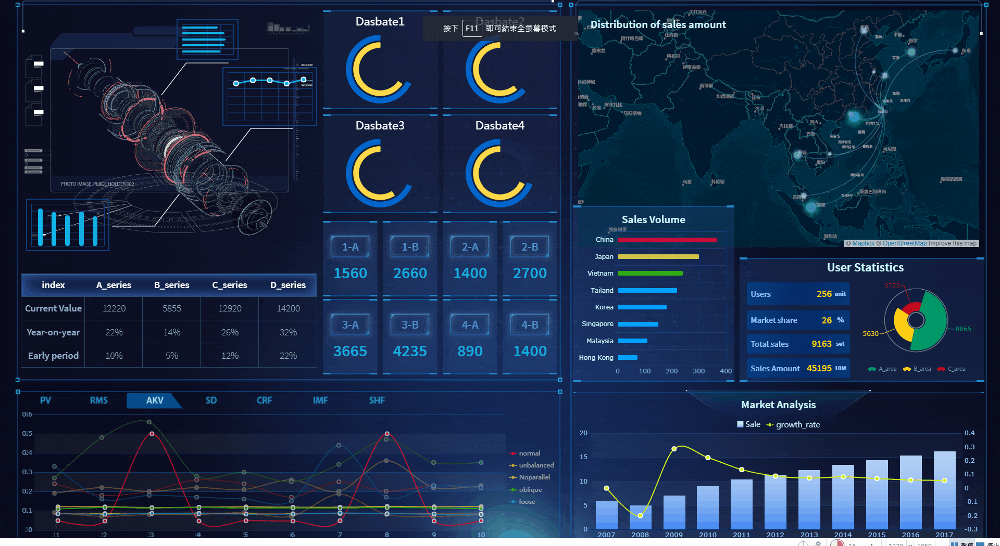

[](https://github.com/KabbisB/KabbisB.github.io/blob/main/_config.yml)
<h1 align="center">Hi 👋, I'm Benjamin Kabbis</h1> 

## 🚀 **Navigation**

[About Me](#about-me) | [Contact](#contact) | [Skills](#skills)  | [Projects](#projects)

---

## 📊 **About Me**

<p align="center">I am a Data Analyst with 2+ years of experience turning complex data into actionable insights. Skilled in Python, SQL, Excel, Power BI, and Tableau, I find passion in data visualization, predictive modeling,and process optimization. I have successfully executed data migration, improved decision-making velocity, and minimized operating costs. Data security and compliance are at the heart of what I do, along with business acumen and stakeholder management & Agile experience to deliver real solutions.</p>


<p align="left">  </p>

## 📬 **Contact Me**

Feel free to reach out to discuss analytics, collaborate on projects, or just connect:
- **Email:** [](mailto:kabbisbenjamin@gmail.com)
- **LinkedIn:** [](https://www.linkedin.com/in/kabbisbenjamin)
- **Leetcode:** [](https://leetcode.com/u/Kabbis/)

- **Github:** [](https://github.com/KabbisB)


## 🔧 My Skills

| Skill                         | Icon                                                                                 |
|-------------------------------|--------------------------------------------------------------------------------------|
| **Data Visualization**        |   |
| **Programming**               |  |
| **Databases**                 |   |
| **Advanced Excel**            |  |
| **Statistical Analysis**      |  |
| **HTML**                      |  
| **CSS**                       |  | 

---


<p></p>

<p>&nbsp;</p>

<p></p>


## 📂 **Portfolio Projects**


### 📌 Project 1: [Heart Attack Prediction](https://github.com/KabbisB/KabbisB.github.io/blob/main/HeartAttackPredictionReport.pbix)

---

**1. Tools Used**


**(a) Power BI for Loading and Cleaning the Data**

- Power BI worked well for this, it can load in data from multiple formats like excel or csv.
- It makes sure that data can be processed smoothly.
  
**(b) Imputation of Missing Values**

- The missing data were treated by the following methods:
- Missing value rows were dropped or imputed
- Gaps for categorical columns, such as *Diet*, were replaced with the most common value.
- For the numeric columns like *Cholesterol* or *Heart Rate*, the average was put in place of the missing values.
  
**(c) Transformation of Data**
  
- Power Query was used to transform the data. Using the following DAX formula, a new measure for Risk Score was created:
  ```DAX
  Risk_Score = 
 (IF(VALUE([Cholesterol]) > 200, 1, 0)) +
(IF(VALUE([Obesity]) = 1, 1, 0)) +
(IF(VALUE([Smoking]) = 1, 1, 0)) +
( IF( VALUE([Exercise Hours Per Week]) <2, 1, 0 ))
  ```
- The above formula calculates a straightforward risk score across several health factors.
- Other measures that we calculated with DAX were:
  - Average BMI  
  - Average Cholesterol Levels
  - Average Risk Score  
  - Average Exercise Hours per Week
    
**(d) Data Formatting**

- Columns were properly labeled to fulfill analysis requirements:
  
  **Continuous variables (Numbers):**
  
- Age, Cholesterol, Blood pressure
  
   **Categorical Variables:**
  
- Sex, Smoking, Diabetes, Heart Attack Risk

**2. Project Description**

With a dataset with factors as such as age, medical history, and lifestyle choices, this project deals with making a heart attack risk prediction model. Designed a Power BI dashboard to help clinicians identify patients with high risk and the top contributors in causing the heart attacks.


**3. Key Findings**

**Identified Risk Factors**
— Smokers, people with high cholesterol and those under stress were at a higher risk of heart attacks.
— Lack of exercise and obesity accounted for a considerable portion of the increased risk.

**Model Impact**

— The heart risk scoring model helps healthcare workers to:
— Diagnose the high-risk people early.
— Intervene in a timely manner and implement preventative measures.

**Actions You Can Take Right Now**

  - **Prevention:** Promote behavior change like greater amounts of activity, cessation of smoking and reduced cholesterol levels
  - **Healthcare Policies:** Information from this model can help public health measures aimed at people at risk.

**4. Dashboard Overview**


**Power BI EDA (Exploratory Data Analysis)**

This dashboard includes visuals which give insights into the data:

**(a) Line Graph**  

- **Risk Score Triglycerides vs Average Triglycerides:**

- The higher the triglycerides, the greater the risk of heart attacks and other cardiovascular disease.
- Triglycerides, a variety of fat in the blood, were positively associated with heart attack risk.
- This association was stronger among males which may be due to differences in lifestyle.
  
**(b) Donut Chart**


- **Average Risk Score by Diet Type**:

- A healthy diet was linked to a less risky score than an unhealthy diet.
- Perhaps note the most impressive, this effect of which are both Argentina and Colombia diets on heart attack rate.
  
**(c) Treemap**

- **Smoking, Obesity and Alcohol Consumption Combined:**

- This visualization highlighted how unhealthy lifestyles lead to heart attacks.
– Risk was sharply elevated in those who smoked, were obese, or consumed alcohol.

**(d) Map Visualization**

- **Topography of High-Risk Patients:**
  
- This map represents the number of high-risk patients across each country, with varying shades of color corresponding to the average risk of heart attack.
  
**(e) Slicers for Filter**

- **Sex**, **country**, and **age group** slices were added to filter and drill down into demographics.

**(f) Upper Part (KPIs)**

**KPI Cards:**  

- Average BMI: **27.5**  
- HDL Cholesterol Risk Score: **<5**
- Cholesterol: **210 mg/dL**
- Average Weekly Training Spend: **2.3 hours**
  


### 📌 Project 2:[Movies Dataset Analysis Project — IMDB](https://github.com/KabbisB/AnalyticsPortfolio/blob/main/HeartAttackPredictionReport.pbix)

---

**Objective**

The goal of this project is to perform exploratory and descriptive analysis on the top 1000 movies: the IMDB movie dataset. It contains extensive details about the movies such as ratings, directors, actors, genre, runtime, revenue, etc. In this analysis, we explore the movie data set and answer some SQL based questions on it to gain insights on trend in movie industry and performances of actors and directors.


**Dataset Overview**

**1. Context**

IMDB Top 1000 Movies and TV Lists The data set contains 1000 movies and TV lists. It could be helpful in understanding the factors that lead to the success of a movie and show including gross revenue versus votes, ratings versus directors and actors, etc.

**2. Content**

Here are the columns of the dataset:

| Column Name        | Description                                                                 |
|--------------------|-----------------------------------------------------------------------------|
| **Title** | **Series_Title**   Title of movie or TV show.` |
| **Released_Year** | Year in which the movie/TV show was released. |
| **Certificate**    | The age certificate (i.e. PG, R, etc.) |
| **Runtime**        | Total runtime (in minutes). |
| **Genre**          | Genre(s) (e.g., Drama, Comedy, etc.) of the movie. |
| **IMDB_Rating**    | IMDB rating of the movie/show (on a scale of 1-10) |
| **Overview**          | Sentence or two about the movie/TV show. |
| **Meta_score**     | The critic score for the movie/TV show (which MetaCritic aggregates). |
| **Director**       | Names of the movie/TV show director. |
Star1 | Star2 | Star3 | Star4 | Names of the main actors starring in the move. |
| **No_of_votes** | Total no. of votes received by the movie/show from IMDB. |
| **Gross**          | Total revenue received by the film (USD). |


## 🔧 Skills Used

**•	Data Retrieval (SELECT):** Queried and extracted specific information from the database.

**•	Data Aggregation (e.g SUM, MIN, MAX, COUNT):** Calculated totals, such as sales and quantities, and counted records to analyze data trends.

**•	Data Filtering (e.g WHERE, BETWEEN, IN, AND):** Applied filters to select relevant data, including filtering by ranges and lists.

**•	Data Source Specification (FROM):** Specified the tables used as data sources for retrieval

**•	Data Joins (e.g SELF JOIN, INNER JOIN):**


- **Directors Average Rating:** Average IMDB rating of all showed movies per director
- 
- **Actor Collaboration Frequency**: How many times actors have worked a project together


**Exploratory Data Analysis (EDA)**

**1. Gross Revenue Trends**

- Distribution of `Gross` by movie
- Get top 10 grosser movies

**2. IMDB Ratings**

- Get the distribution of `IMDB_Rating`, and the `Meta_score` correlation with it
- Discover the highest-rated movies and the ingredients behind their success.
  
**3. Director Analysis**

- Identify which directors directed the most movies
- Examine the correlation between directors and average film gross/income.
  
**4. Genre Analysis**

- Examine the genre popularity.
- Genre preferences by year and region
  
**5. Actor Insights**

- Find out which actors occur the most in the dataset
- Exploring the gross box office collection and IMDB rating of movies which have mentioned actors.


**Key Takeaways and Suggestions**

**1. Revenue Drivers:**

New projects need to be given to directors and actors that have a proven record of making money.
Now moving on to the Genre plot: well it looks like genres such as Action and Drama, Comedy seem to generate more money.

**2. Collaboration Trends:**

- Actors with the successful box office records should team up more often.
- Work on movies for young directors who has a great IMDB rating with great stars.
  
**3. Audience Engagement:**

- More votes for movies mean that they are a balance of good actors and good story.
- Marketing campaigns should target voter registration and engagement

**4. Genre Focus:**

– Know what genres will play well for certain directors and actors.
- Discover untapped genres based on current trends

**Deliverables**

1. Dataset Cleaned and Processed.
2. SQL Queries to Answer Key Questions
3. Plots related to EDA (e.g., revenue trends and genre analysis).
4. A report that synthesizes findings and recommendations for action.

---

### 📌 Project 2:Emirage Global Sales Performance Dashboard

## Objective

The aim of this project is to create a simple and interactive sales performance dashboard in Excel using the provided dataset. The dashboard will highlight essential metrics, track performance, and help identify areas for improvement.

---

## 1. Project Scope

### 1.1 Overview

The dashboard will include:
- Key metrics such as Sales Completion Rate, Profit Completion Rate, and Customer Completion Rate.
- Visual elements like pie charts, line charts, bar charts, radar charts, and map charts to display trends and performance across different regions.
- Interactive filters to sort data by Month, Quarter, and Region for more detailed analysis.

### 1.2 Audience

This dashboard is intended for:
- Sales managers and leaders who want to monitor sales performance.
- Regional teams requiring insights on local sales performance.
- Decision-makers seeking to spot patterns and areas for potential growth.

### 1.3 Tools and Technologies

- **Microsoft Excel**: Used for building and displaying the dashboard.
- **Excel Features**: PivotTables, Charts, Slicers, and Conditional Formatting.

---

## 2. Dataset Overview

### 2.1 Data Fields

The dataset includes the following fields:
- **Month**: Time of sale (e.g., Jan-23, Feb-23).
- **Region**: Geographic regions (e.g., Argentina, Brazil).
- **Sales**: Total sales during that period and region.
- **Profit**: Total profit during that period and region.
- **Target Sales**: Sales goals for the region.
- **Customers**: Number of customers served.
- **Quarter**: Fiscal quarter (e.g., Q1).
- **Completion Rates**: Sales, Profit, and Customer completion rates represented as percentages.

---

## 3. Dashboard Design

### 3.1 Layout and Components

#### Header Section:
- **Title**: Emirage Global Sales Performance Dashboard.
- **Logo**: Company branding.

#### Charts Section:
1. **Line Chart**: Monthly Sales vs. Target Sales.
2. **Bar Chart**: Profit performance by region.
3. **Map Chart**: Profit distribution across regions.
4. **Radar Chart**: Sales Completion rates by region.
5. **Pie Charts**: Average Sales Completion Rate and Profit Completion Rate.

#### Filters Section:
- **Filters** for Month, Quarter, and Region for easy data segmentation.

#### Detailed Table:
- An interactive table showing key metrics by region, such as Sales, Profit, Customers, and Completion Rates.

### 3.2 Design Principles

- **Color Scheme**: Professional, consistent color palette.
- **Fonts**: Clear, easy-to-read fonts.
- **Interactivity**: Dynamic charts and filters for a better user experience.
- **Labels**: Descriptive titles and labels for charts to ensure clarity.

---

## 4. Implementation Plan

### 4.1 Data Preparation

1. **Import Data**: Load the dataset into Excel and format it as a table.
2. **Clean Data**: Ensure proper number formatting (e.g., currency), check for data consistency, and remove any duplicates.

### 4.2 Visualizations

1. **Pie Charts**: Display Sales and Profit Completion Rates, with percentage labels.
2. **Line Chart**: Compare Monthly Sales vs. Target Sales with markers.
3. **Bar Chart**: Visualize Profit by Region, sorted from highest to lowest.
4. **Map Chart**: Plot profit distribution across regions.
5. **Radar Chart**: Compare Sales, Profit, and Customer Completion Rates by region.

### 4.3 Filters

- Implement filters for Month, Quarter, and Region, linking them to tables and charts for easy sorting and viewing.

---

## 5. Example Dashboard Layout

### 5.1 Header Section
- **Title**: Emirage Global Sales Performance Dashboard.
- **Date Range Filter**: A dropdown for selecting Month or Quarter.

---

## 6. Recommendations and Insights

### 6.1 High-Performing Regions
- **Focus on successful regions** like Columbia (96% Sales Completion) to maintain momentum.

### 6.2 Underperforming Regions
- **Investigate regions with lower performance** (e.g., Chile, Los Angeles) that have completion rates below 80%.

### 6.3 Customer Engagement
- **Increase outreach** in regions with fewer customers, such as Chicago.

### 6.4 Target Adjustment
- **Adjust sales targets** for regions consistently missing their goals.

---


